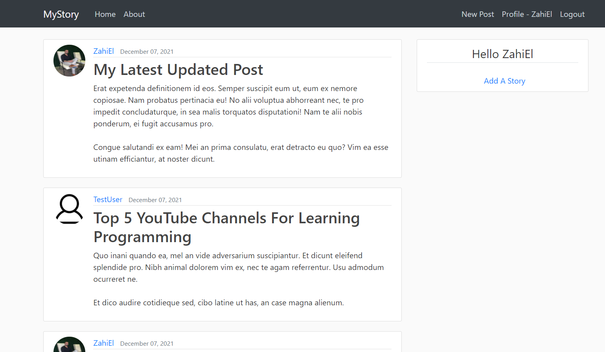

# django_project
My first website using django web platforme.
I choose to build my site using Django platform, which is very popular among Python programmers.    
In addition, I used bootstrap, html, css to design the site and build the pages.  
  
The site is a blog that simulates an app such as Twitter, having a registration system and user login.   
Users share their stories with each other and there is an ability to be interested in the stories of   
a unique user using a filter I been created.  

I enjoyed building the site with the help of Django platform and it was very effective for my purpose.

   

 
